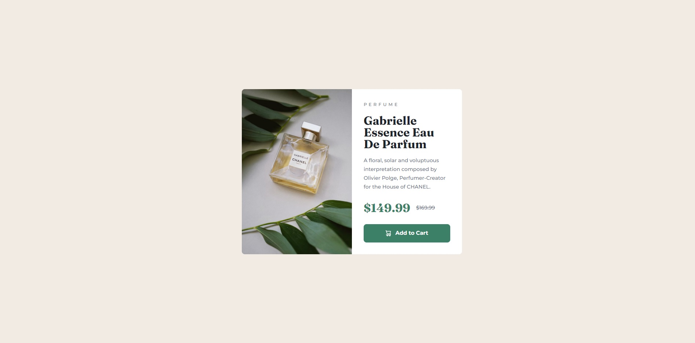

### Screenshot



### Links

- Live Site URL: [here](https://ils01.github.io/Product-preview-card-component/)

## My process

### What I learned

- how to add custom fonts via html

- possible naming ways for classes

- ```
  <picture class="product__img">
            <source
              srcset="images/image-product-desktop.jpg"
              media="(min-width:600px)"
            />
            
          </picture>
  ```

- ```
  <span class="visually-hidden">Current price:</span>
                $149.99

      .visually-hidden:not(:focus):not(:active) {
          clip: rect(0 0 0 0);
          clip-path: inset(50%);
          height: 1px;
          overflow: hidden;
          position: absolute;
          white-space: nowrap;
          width: 1px;
      }
  ```

- one more css reset: https://www.joshwcomeau.com/css/custom-css-reset/

- style for naming custom css properties

- display: inline-flex;

## Acknowledgments

just coded along this awesome guide https://youtu.be/B2WL6KkqhLQ
